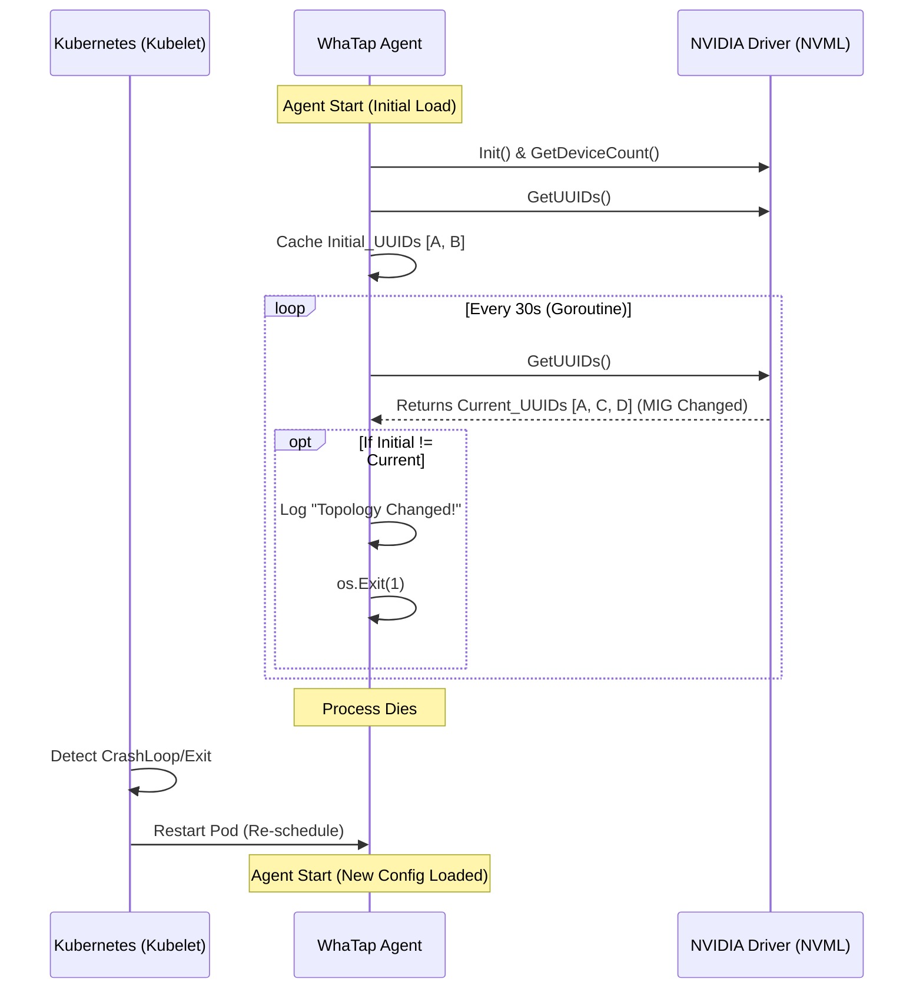

네, 와탭(WhaTap) 쿠버네티스 에이전트의 안정성을 높이는 매우 중요한 기능입니다. 말씀하신 **"GPU 토폴로지 변경 감지 및 Self-Healing"** 기능을 위한 PRD(제품 요구사항 정의서) 초안을 작성해 드립니다.

이 문서는 개발팀 내부 리뷰나 경영진 보고용으로 활용하실 수 있도록 **기술적 구현 상세**와 **비즈니스 임팩트**를 포함하여 구성했습니다.

---

# [PRD] WhaTap K8s Agent: Dynamic GPU Topology Detection & Self-Healing

| 항목 | 내용 |
| --- | --- |
| **문서 버전** | v0.1 (Draft) |
| **작성일** | 2026-01-19 |
| **대상 프로젝트** | WhaTap Kubernetes Monitoring Agent |
| **관련 기능** | GPU Monitoring, MIG Support |
| **우선순위** | High (고객사 MIG 동적 운영 환경 대응 필수) |

## 1. 개요 및 배경 (Overview & Background)

### 1.1 배경

* 최근 AI 인프라 운영 트렌드는 **MIG(Multi-Instance GPU)**를 활용하여 GPU 리소스를 동적으로 분할/재할당하는 방식이 확산되고 있음.
* GPU Operator 등을 통해 노드 재부팅 없이 MIG 구성을 변경할 경우, 기존 실행 중인 와탭 에이전트 프로세스는 초기 구동 시점의 **Stale GPU Handle(이전 UUID)**을 계속 참조함.

### 1.2 문제점 (Problem Statement)

* MIG 구성 변경 시, 에이전트가 존재하지 않는 GPU 인스턴스를 모니터링하려 시도하여 **데이터 수집 실패** 또는 **수집 중단** 발생.
* 현재는 운영자가 수동으로 와탭 에이전트 Pod를 재시작(Restart)해야만 정상화됨. 이는 "설치 후 잊어버리는(Set-and-Forget)" 모니터링 제품의 경험을 저해함.

### 1.3 목표 (Goals)

* 에이전트가 주기적으로 GPU 하드웨어 구성 변경(특히 MIG 프로파일 변경)을 스스로 감지.
* 변경 감지 시, 즉시 프로세스를 종료(`exit 1`)하여 쿠버네티스 컨트롤러(DaemonSet)에 의해 자동으로 재시작되도록 유도 (Self-Healing).
* 이를 통해 수동 개입 없이 **최대 1~2분 내**에 새로운 GPU 구성에 맞춰 모니터링이 자동 재개되도록 함.

---

## 2. 상세 요구사항 (Functional Requirements)

### 2.1 GPU 구성 스냅샷 (Initial Snapshot)

* **FR-01:** 에이전트 시작(Boot) 시점의 GPU 정보를 메모리에 캐싱해야 한다.
* **저장 데이터:** GPU 개수, 각 GPU(또는 MIG 인스턴스)의 UUID 목록.
* **소스:** NVML (NVIDIA Management Library) 또는 DCGM.

### 2.2 주기적 변경 감지 (Periodic Detection)

* **FR-02:** 별도의 고루틴(Go) 또는 스레드를 통해 설정된 주기마다 현재 GPU 상태를 조회해야 한다.
* **기본 주기:** 30초 (Configurable)
* **비교 로직:**
1. 현재 감지된 GPU 개수 vs 초기 스냅샷 개수
2. 현재 감지된 UUID 리스트 vs 초기 스냅샷 UUID 리스트

* **FR-03:** 단순 상태 변경(P-State, Temperature 등)은 무시하고, **토폴로지 변경(구성 변경)**만 감지해야 한다.

### 2.3 자동 재시작 트리거 (Self-Healing Trigger)

* **FR-04:** 구성 불일치(Mismatch)가 확인되면 즉시 **Info 레벨 로그**를 남기고 프로세스를 종료해야 한다.
* **로그 메시지 예시:** `"[GPU-Watcher] MIG configuration change detected (Old UUIDs: [...], New UUIDs: [...]). Initiating self-restart."`
* **종료 코드:** `os.Exit(1)` (비정상 종료로 처리하여 K8s가 즉시 재시작하도록 유도)

### 2.4 설정 옵션 (Configuration)

* **FR-05:** 고객이 이 기능을 끄거나 주기를 변경할 수 있어야 한다.

---

## 3. 기술적 구현 계획 (Technical Implementation)

### 3.1 아키텍처 다이어그램 (Concept)

### 3.2 예외 처리 및 안전장치 (Safety Mechanisms)

* **NVML 일시적 오류 방지:** NVML 조회 실패(`NVML_ERROR_UNKNOWN` 등) 시 즉시 재시작하지 않고, **연속 3회 실패 시** 재시작하도록 하여 일시적인 드라이버 응답 지연에 의한 불필요한 재시작 방지 (Flapping 방지).
* **Cool-down:** 에이전트 시작 후 최초 1분간은 변경 감지 로직을 수행하지 않음 (초기화 안정화 시간 확보).

---

## 4. 검증 계획 (QA & Testing Plan)

### 4.1 테스트 시나리오

1. **MIG 활성화 테스트:** Non-MIG 상태에서 MIG를 활성화했을 때 에이전트가 재시작되는가?
2. **MIG 재구성 테스트:** `1g.5gb` 프로파일에서 `3g.20gb`로 변경 시 재시작되는가?
3. **MIG 비활성화 테스트:** MIG를 끄고 일반 모드로 복귀 시 재시작되는가?
4. **임계치 테스트:** 드라이버 응답 지연 등 노이즈 상황에서 에이전트가 버티는지 확인.

### 4.2 성공 기준 (Success Metrics)

* GPU 구성 변경 발생 후 **2분 이내**에 에이전트가 재시작되어 새로운 메트릭(변경된 UUID 기반)을 수집해야 함.
* 변경이 없는 평시 상황에서는 에이전트가 재시작되지 않아야 함 (False Positive 0건).

---

## 5. 기대 효과 (Impact)

* **운영 비용 절감:** 고객사 엔지니어가 MIG 변경 시마다 와탭 에이전트를 수동으로 재시작할 필요가 사라짐.
* **데이터 신뢰성 향상:** GPU 구성 변경 직후부터 올바른 메트릭 수집이 보장됨 (데이터 공백 최소화).
* **제품 완성도:** NVIDIA GPU Operator 등 최신 클라우드 네이티브 생태계와 완벽하게 호환되는 "Smart Agent" 이미지 구축.

---

### 💡 다음 단계 (Action Items)

1. Go 언어 기반의 **NVML Wrapper(예: `github.com/NVIDIA/go-nvml`)를 사용한 프로토타입 코드 작성**.
2. 사내 테스트 베드(DGX A100 등)에서 MIG 변경 시나리오 재현 및 로그 확인.

바로 **프로토타입 구현을 위한 Go 언어 예제 코드(변경 감지 로직)**를 작성해 드릴까요?